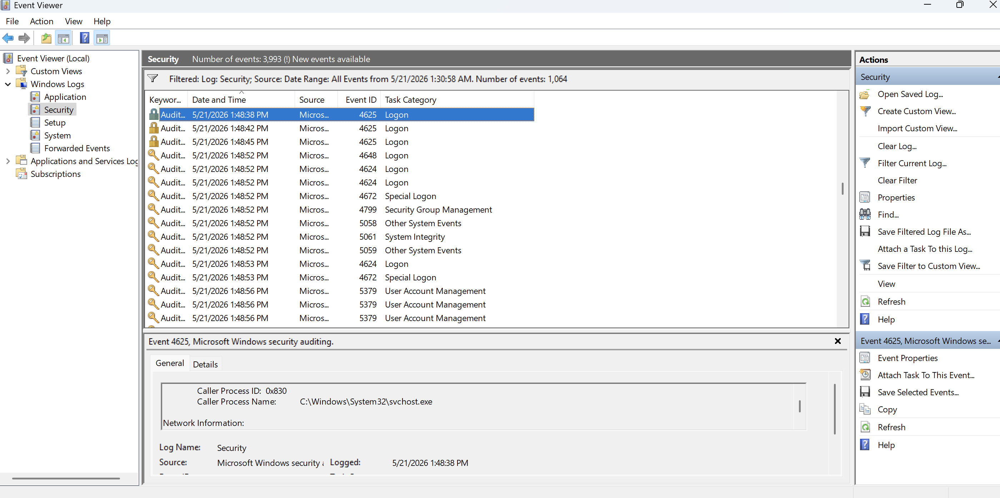
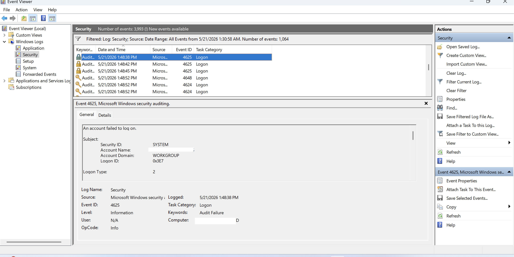
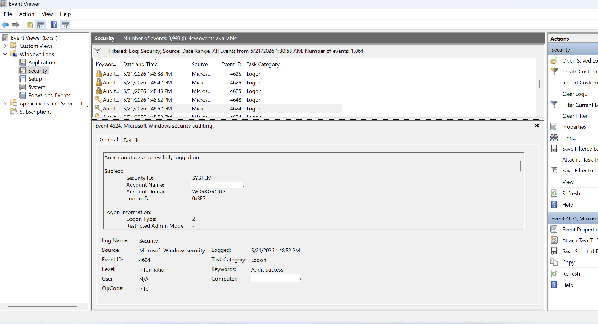
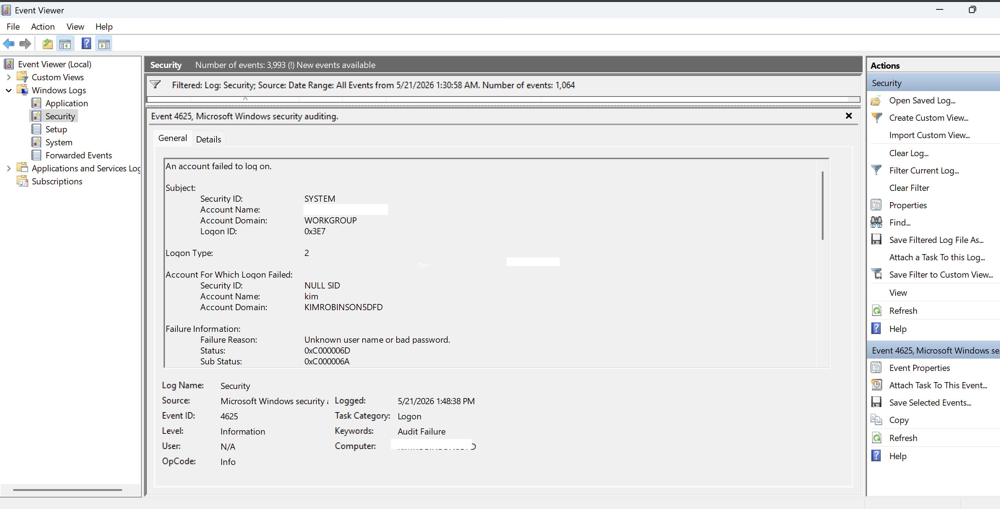

# Security Log Analysis Project

## Overview
This project demonstrates basic security monitoring and log analysis using system event logs.

## Objective
To identify and analyze successful and failed login attempts using system security logs.

## Tools Used
- Windows Event Viewer

## What I Did
- Accessed and navigated system security logs
- Identified login-related events (Event ID 4624 and 4625)
- Simulated failed login attempts
- Analyzed event details such as timestamps, user accounts, and logon types

## Key Findings
- Detected multiple failed login attempts followed by a successful login
- Observed how login attempts are recorded and tracked in system logs
- Observed multiple failed authentication attempts followed by a successful login event, demonstrating how security logs can be used to monitor and investigate authentication activity.

## Screenshots

## Skills Demonstrated
- Log analysis
- Security monitoring
- Threat detection basics
- Troubleshooting

## Key Takeaways
This project helped me understand how security events are logged and how analysts can detect suspicious activity through log monitoring.
